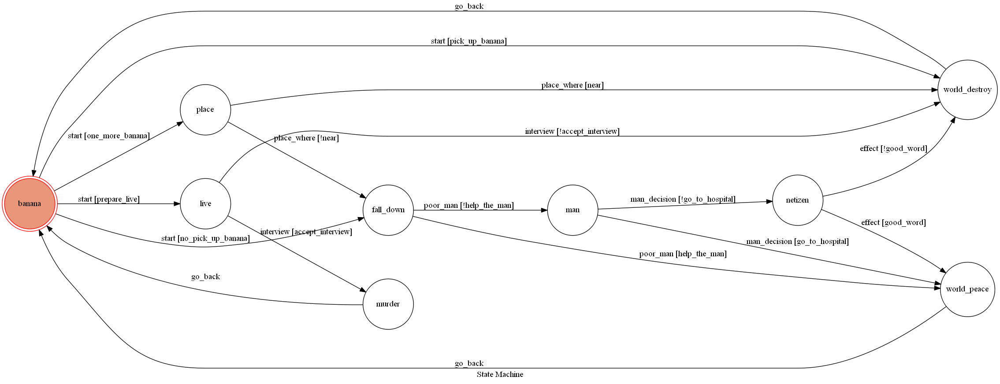

# TelegramBot
## ButterflyEffect

在生活中許多小小的事情，都有可能引發巨大的連鎖反應。

讓我們來看看你的選擇會導致什麼結果吧!

## Setup

### Prerequisite
* Python 3

#### Install Dependency
```sh
pip install -r requirements.txt
```

* pygraphviz (For visualizing Finite State Machine)
    * [Setup pygraphviz on Ubuntu](http://www.jianshu.com/p/a3da7ecc5303)

### Secret Data

`API_TOKEN` and `WEBHOOK_URL` in app.py **MUST** be set to proper values.
Otherwise, you might not be able to run your code.

### Run Locally
You can either setup https server or using `ngrok` as a proxy.

**`ngrok` would be used in the following instruction**

```sh
ngrok http 5000
```

After that, `ngrok` would generate a https URL.

You should set `WEBHOOK_URL` (in app.py) to `your-https-URL/hook`.

#### Run the sever

```sh
python3 app.py
```

## Finite State Machine


## How to chat with bot
一開始bot會問問題，只要從選項中擇一輸入就行了

例如:
```sh
在一個風和日麗的午後，你在路上看到香蕉皮，你要把它撿起來嗎?

要/不要
```

使用者選擇輸入"要"或"不要"

接下來就看看會發生什麼事吧!
